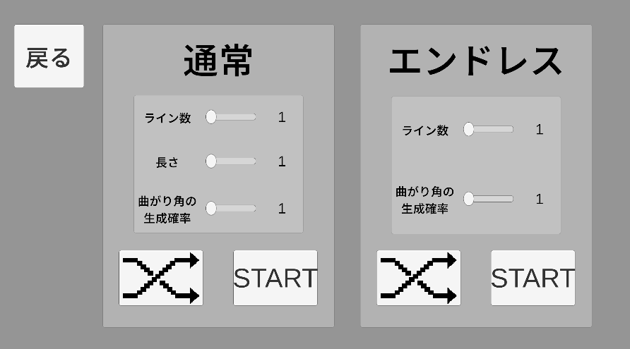
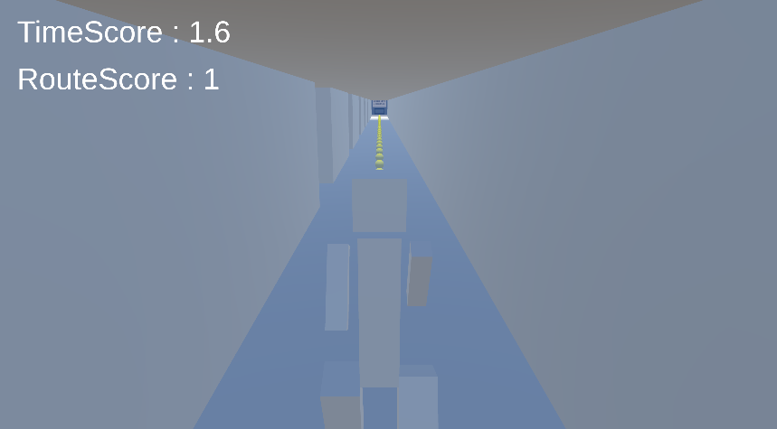
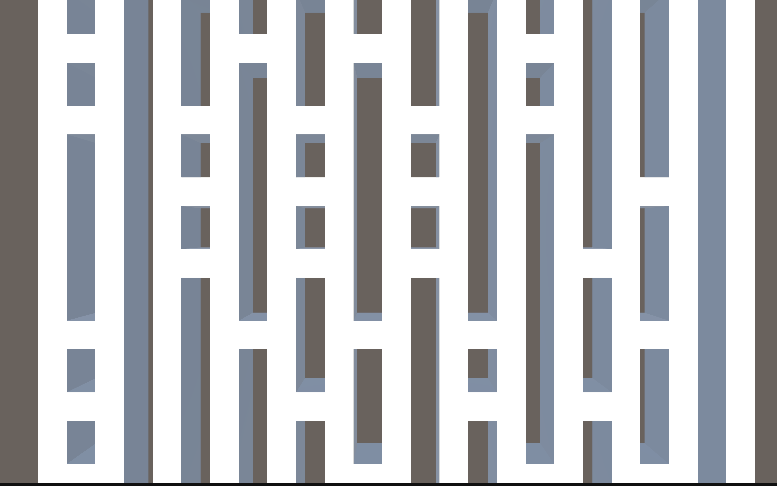

# あみだくじシミュレーター

Unity で開発しているゲームプロジェクトです。  
学習用・ポートフォリオ用として制作しています。

## ゲーム概要
Unityで製作した、あみだくじ × ランゲームです。
プレイヤーは自動生成されたあみだくじから、一つのラインを選択しそのラインに沿ってあみだくじのルールを守りながら移動します。迫りくる壁に追いつかれる、曲がり角で正常に曲がれなかったらゲームオーバーです。

あみだくじは、道の真ん中を走るほど正確性に由来するポイントを稼ぐことが出来ます。また、あみだくじをゴールするのにかかった時間も表示されます。ポイントを出来るだけ最大化しながらもタイムを縮めましょう！

ステージの自動生成
- あみだくじのライン数、長さ、曲がり角の生成確率を任意で調節できます。数値を決めたらあみだくじが自動生成さます！

二種類のゲームモード
- Nomalモード　: ゴール有りの任意の長さのステージ！ ゴール後に任意のテキストが表示されます。設定画面からテキストを入力して、あみだくじを楽しみましょう！
- Endlessモード : ゴール無しで永遠に続くステージ！ ポイントに応じて走る速度が速まっていきます！ どれだけ短時間にポイントを稼げるかを目指すのもいいでしょう!

## スクリーンショット
以下のフォルダにいくつかのスクリーンショットが保存されています。
[Screenshots](./Screenshots)

(例)

## 主な機能
- プレイヤー操作
- カメラの自動追尾
- ステージの自動生成
- スコア管理
- アニメーション
- BGM,SE
- UI

## 製作環境
- Unity 6.3 LTS (6000.3.10f1)
- Aseprite(バージョン 1.3.18.6)
- AI(Microsoft Copilot バージョン 154.0.4258.62)
- C#

## フォルダ構成（アセット内のみ）
- [Animations](./Assets/Animations) ~ アニメーション
- [Fonts](./Assets/Fonts) ~ テキストフォント
- [Materials](./Assets/Materials) ~ マテリアル
- [Prefabs](./Assets/Prefabs) ~ プレハブ
- [Scenes](./Assets/Scenes) ~ シーン
- [Scripts](./Assets/Scripts) ~ スクリプト
- [Sounds](./Assets/Sounds) ~ 自作サウンド
- [Sprites](./Assets/Sprites) ~ 二次元絵（Asepriteで作った絵）
- [Textures](./Assets/Textures) ~ 自作テクスチャ

- `TextMeshPro` ~ UnityからTextMeshProを使うためにインポートしたTextMeshProのEssentialのそのままのフォルダ
- `OtherWorks` ~ 外部から入手した再配布禁止アセット

## 使用技術（Unity / C#）

### Unity
- CharacterController によるプレイヤー移動
- Animator によるアニメーション制御
- Input System による操作入力
- Instantiate / Destroy を用いたステージの動的生成
- TextMeshPro による UI 表示
- ScrollView + InputField によるユーザー入力管理
- Slider / Toggle による設定 UI
- AudioSource による BGM / SE 再生
- SceneManager によるシーン遷移
- Singleton（DontDestroyOnLoad）による設定データ保持

### C#
- コルーチン（カウントダウン処理）
- 配列・リストによるステージ管理
- ルート判定アルゴリズム（Swap）
- トリガー判定によるイベント処理
- UI パネルの自動生成・削除ロジック
- 列挙体（Enum）によるステージ種別管理

## 主なスクリプト

### ゲーム進行
- GameManaging.cs
- SceneControling.cs
- PlayerMove.cs
- CameraFollowing.cs
- WallClosing.cs

### あみだくじ生成
- AmidakuziGenerating_Nomal.cs
- AmidakuziGenerating_Endless.cs
- AmidakuziGenerateSetting.cs
- AmidakuziGenerateSettingMediating.cs

### 判定・ギミック
- SuccessJudging.cs
- ScoreGiving.cs
- GoalDeciding.cs

### UI
- UIControling_Main.cs
- SerectLineControling.cs
- SerectTimeCameraControling.cs
- UIControling_GoalPresentText.cs
- UIConroling_SettingMenu_PresentWord.cs
- PresentWordInputFieldPanel.cs
- Slider_TextAdjusting.cs
- ToggleMediating.cs

### サウンド
- BGMManaging.cs
- SEManaging.cs
- ButtonMediating.cs

### データ保持
- GoalPresentWordData.cs

## 外部フォントについて
本プロジェクトでは Google が提供する Noto Sans JP フォントを使用しています。

フォントは SIL Open Font License (OFL) のもとで配布されており、
商用利用・再配布が許可されています。

フォントは以下のページから入手できます：
https://fonts.google.com/noto/specimen/Noto+Sans+JP

本リポジトリにはフォントファイルを含めていません。
必要な場合は上記リンクからダウンロードし、プロジェクト内の
`Assets/Fonts/` に配置してください。

## 外部音源について
本プロジェクトで使用している音源のいくつかは フリーBGM・音楽素材MusMus 、効果音ラボ　から入手した音源になります。

各サイトの音源使用について以下の利用規約に従って使用しています :

- フリーBGM・音楽素材MusMus ~ MusMus音楽素材利用規約
- 効果音ラボ ~ サイト内利用規約　

いずれのサイトにおいても音源の商用利用が許可、再配布が不許可となっています。

音源は以下のページから入手できます :

- フリーBGM・音楽素材MusMus ~ https://musmus.main.jp
- 効果音ラボ ~ https://soundeffect-lab.info

本リポジトリには音源ファイルは含まれていません。
必要な場合は上記リンクからダウンロードし、プロジェクト内の
`Assets/OtherWorks/` に配置してください。

## ライセンス
MIT
